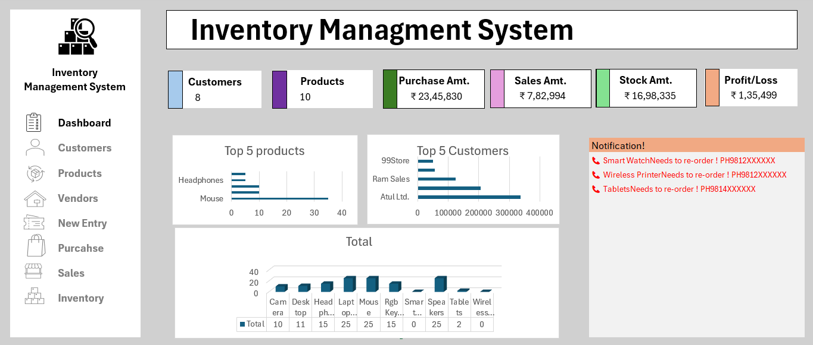

# Inventory_management_system
Self project for tracking inventory, sales, purchases and auto re-order notifications.

## Dashboard Preview

## Features
- **Live Dashboard**: Customers, Products, Sales, Purchase, Stock, P/L cards
- **Auto Re-order Alert**: Stock < 5 hone par vendor ka naam + phone number with ☎️
- **Top 5 Analysis**: Best selling products aur top customers ke charts
- **Multi-Sheet System**: Customers, Products, Vendors, Purchase, Sales, Inventory linked
- **Formulas Used**: `VLOOKUP`, `IF`, `SUMIFS`, `UNICHAR`, Table References

## Tech Stack
- **Tool**: Microsoft Excel
- **Functions**: VLOOKUP, IF, SUMIFS, UNICHAR, Structured References
- **Features**: Data Validation, Tables, Charts, Conditional Formatting
- 
## How to Use
1. Download `Inventory-Management-System.xlsx`
2. Open in MS Excel
3. Update `Products`, `Vendors`, `Purchase`, `Sales` sheets
4. Dashboard will auto-update
